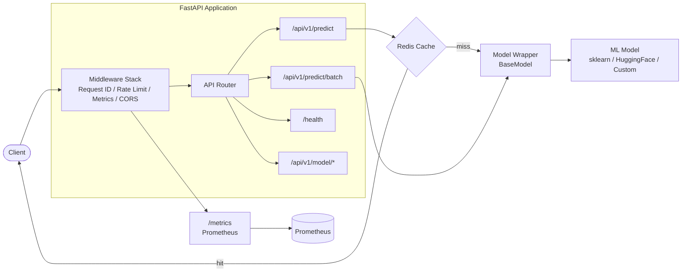

# fastapi-ml-template


A production-ready FastAPI template for deploying machine learning models as REST APIs. It provides a standardized project structure with built-in health checks, caching, metrics, rate limiting, and authentication so you can focus on your model rather than boilerplate infrastructure.

## Features

- **Health Checks** -- `/health`, `/readiness`, and `/liveness` endpoints for Kubernetes probes
- **Single & Batch Inference** -- `/api/v1/predict` and `/api/v1/predict/batch` with automatic input validation
- **Redis Caching** -- deterministic request hashing with configurable TTL to avoid redundant inference
- **Prometheus Metrics** -- request latency histograms, inference counters, and model load time at `/metrics`
- **Rate Limiting** -- per-client sliding window rate limiter via middleware
- **API Key Authentication** -- optional header-based API key gate
- **Structured Logging** -- JSON-formatted logs via `structlog` with request ID correlation
- **Docker Ready** -- multi-stage Dockerfile, docker-compose with Redis and Prometheus, non-root runtime user
- **Model Registry** -- plug-and-play model registration supporting sklearn, HuggingFace, and custom wrappers
- **CORS Middleware** -- configurable allowed origins

## Quick Start

```bash
git clone https://github.com/gitblame-hemanth/fastapi-ml-template.git
cd fastapi-ml-template
docker-compose up --build
```

The API will be available at `http://localhost:8000`. Prometheus is at `http://localhost:9090`.

## Local Development

```bash
# Create virtual environment and install dependencies
python -m venv .venv
source .venv/bin/activate   # Windows: .venv\Scripts\activate
pip install -r requirements.txt

# Copy and edit environment variables
cp .env.example .env

# Start the development server
uvicorn src.main:app --reload --host 0.0.0.0 --port 8000

# Run tests
pytest
pytest --cov=src --cov-report=term-missing
```

## API Documentation

### Endpoints

| Method | Path | Description |
|--------|------|-------------|
| `GET` | `/health` | Service health including model and Redis status |
| `GET` | `/readiness` | Kubernetes readiness probe (503 if model not loaded) |
| `GET` | `/liveness` | Kubernetes liveness probe (always 200) |
| `POST` | `/api/v1/predict` | Single prediction |
| `POST` | `/api/v1/predict/batch` | Batch prediction (up to 100 inputs) |
| `GET` | `/api/v1/model/info` | Currently loaded model metadata |
| `POST` | `/api/v1/model/reload` | Hot-reload model from disk without restart |
| `GET` | `/metrics` | Prometheus metrics endpoint |

### Examples

**Health check:**

```bash
curl http://localhost:8000/health
```

**Single prediction (sklearn):**

```bash
curl -X POST http://localhost:8000/api/v1/predict \
  -H "Content-Type: application/json" \
  -d '{"features": [5.1, 3.5, 1.4, 0.2]}'
```

**Batch prediction:**

```bash
curl -X POST http://localhost:8000/api/v1/predict/batch \
  -H "Content-Type: application/json" \
  -d '{
    "inputs": [
      {"features": [5.1, 3.5, 1.4, 0.2]},
      {"features": [6.2, 2.8, 4.8, 1.8]}
    ]
  }'
```

**Model info:**

```bash
curl http://localhost:8000/api/v1/model/info
```

**Model reload:**

```bash
curl -X POST http://localhost:8000/api/v1/model/reload
```

## Adding Your Own Model

1. **Create a model wrapper** in `src/models/` that inherits from `BaseModel`:

    ```python
    # src/models/my_model.py
    from src.models.base import BaseModel

    class MyModel(BaseModel):
        @property
        def name(self) -> str:
            return "my_model"

        @property
        def version(self) -> str:
            return "1.0.0"

        def load(self) -> None:
            def _load():
                # Load your model artifacts here
                self._model = ...
            self._timed_load(_load)

        def predict(self, input_data: dict) -> dict:
            self._ensure_loaded()
            result = self._model.predict(input_data["features"])
            return {"prediction": result}

        def predict_batch(self, input_data: list[dict]) -> list[dict]:
            self._ensure_loaded()
            return [self.predict(item) for item in input_data]
    ```

2. **Register your model** in `src/models/registry.py`:

    ```python
    from src.models.my_model import MyModel
    register("my_model", MyModel)
    ```

3. **Set the model name** via environment variable:

    ```bash
    APP_MODEL_NAME=my_model
    ```

4. **Optionally implement `warmup()`** to run a dummy prediction at startup for faster first requests.

## Configuration

All environment variables use the `APP_` prefix. See `.env.example` for a complete template.

| Variable | Default | Description |
|----------|---------|-------------|
| `APP_APP_NAME` | `FastAPI ML Service` | Service name shown in health checks |
| `APP_APP_VERSION` | `1.0.0` | Service version |
| `APP_DEBUG` | `false` | Enable debug mode (exposes `/docs` and `/redoc`) |
| `APP_ENVIRONMENT` | `production` | Environment tag (`production`, `staging`, `development`) |
| `APP_API_KEY` | *(none)* | API key for authentication |
| `APP_API_KEY_ENABLED` | `false` | Enable API key requirement |
| `APP_REDIS_URL` | `redis://localhost:6379` | Redis connection URL |
| `APP_REDIS_CACHE_TTL` | `300` | Cache TTL in seconds |
| `APP_MODEL_NAME` | `sklearn_classifier` | Registered model name to load |
| `APP_MODEL_PATH` | *(none)* | Path to model artifacts on disk |
| `APP_RATE_LIMIT_REQUESTS` | `100` | Max requests per window |
| `APP_RATE_LIMIT_WINDOW` | `60` | Rate limit window in seconds |
| `APP_INFERENCE_TIMEOUT` | `30.0` | Inference timeout in seconds |
| `APP_CORS_ORIGINS` | `*` | Comma-separated allowed origins |
| `APP_LOG_LEVEL` | `INFO` | Log level (`DEBUG`, `INFO`, `WARNING`, `ERROR`, `CRITICAL`) |

## Docker Deployment

The `docker-compose.yml` defines three services:

| Service | Image | Port | Purpose |
|---------|-------|------|---------|
| `app` | Built from `Dockerfile` | `8000` | FastAPI ML inference service |
| `redis` | `redis:7-alpine` | `6379` | Prediction caching |
| `prometheus` | `prom/prometheus:latest` | `9090` | Metrics collection and monitoring |

All services run on a shared `ml-network` bridge network. Redis and Prometheus use named volumes for data persistence.

**Customization:**

- Edit `.env` to configure the app service (all `APP_` variables are passed through `env_file`).
- Modify `prometheus.yml` to adjust scrape intervals or add additional targets.
- The Dockerfile uses a multi-stage build with a non-root `appuser` for security.
- Health checks are configured for both the app (HTTP check on `/health`) and Redis (`redis-cli ping`).

## Architecture



**Request flow:**

1. Client sends a request to the FastAPI application.
2. Middleware stack processes the request (assigns request ID, checks rate limits, records metrics, applies CORS).
3. The API router dispatches to the appropriate endpoint.
4. For predictions, the cache is checked first. On a cache miss, the model wrapper runs inference and stores the result.
5. The response is returned with model metadata and cache status.

## Testing

```bash
# Run all tests
pytest

# Run with coverage report
pytest --cov=src --cov-report=term-missing

# Run a specific test file
pytest tests/test_predict.py -v

# Run tests matching a keyword
pytest -k "health" -v
```

Coverage threshold is configured at 80% in `pyproject.toml`.

## Project Structure

```
fastapi-ml-template/
├── src/
│   ├── api/
│   │   ├── middleware/
│   │   │   ├── metrics.py          # Prometheus request metrics
│   │   │   ├── rate_limit.py       # Sliding window rate limiter
│   │   │   └── request_id.py       # X-Request-ID injection
│   │   ├── routes/
│   │   │   ├── health.py           # Health, readiness, liveness
│   │   │   ├── model.py            # Model info and reload
│   │   │   └── predict.py          # Single and batch prediction
│   │   ├── dependencies.py         # FastAPI dependency injectors
│   │   └── schemas.py              # Pydantic request/response models
│   ├── core/
│   │   ├── config.py               # Settings via pydantic-settings
│   │   ├── logging.py              # structlog configuration
│   │   └── metrics.py              # Prometheus metric definitions
│   ├── models/
│   │   ├── base.py                 # Abstract BaseModel class
│   │   ├── registry.py             # Model name -> class registry
│   │   ├── sklearn_model.py        # scikit-learn wrapper
│   │   └── hf_model.py             # HuggingFace wrapper (optional)
│   └── main.py                     # Application factory and lifespan
├── tests/
│   ├── conftest.py                 # Shared fixtures
│   ├── test_config.py
│   ├── test_health.py
│   ├── test_middleware.py
│   ├── test_model.py
│   ├── test_models.py
│   └── test_predict.py
├── .env.example                    # Environment variable template
├── .github/workflows/ci.yml       # GitHub Actions CI pipeline
├── docker-compose.yml              # Multi-service deployment
├── Dockerfile                      # Multi-stage production build
├── prometheus.yml                  # Prometheus scrape config
├── pyproject.toml                  # Project metadata and tool config
└── requirements.txt                # Pinned dependencies
```

## License

This project is licensed under the MIT License.
